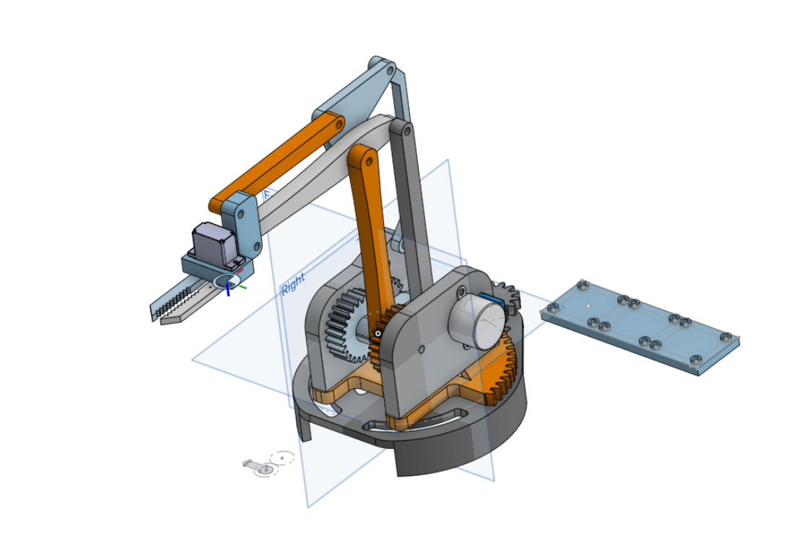
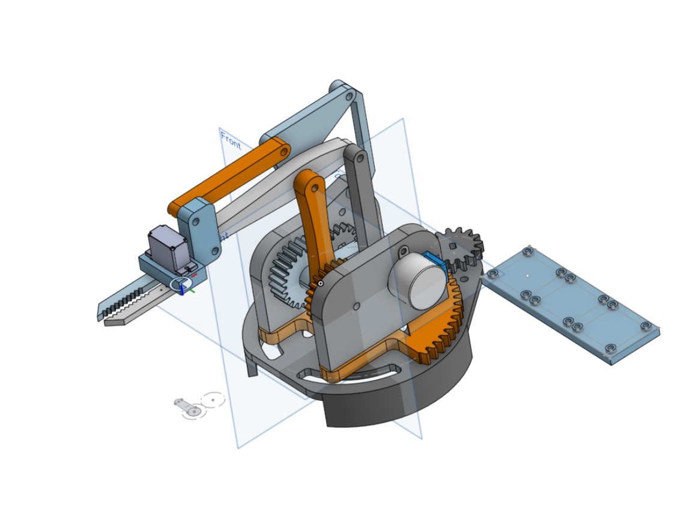
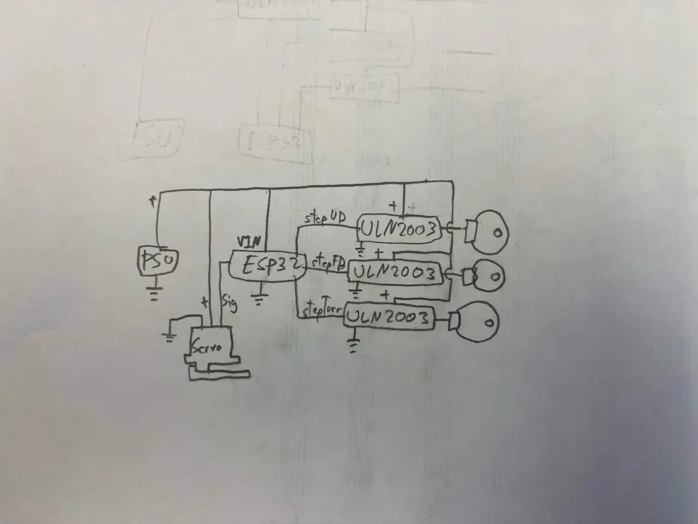

# LimeArm MKI
LimeArm MKI is a 4-bar-linkage style robotic arm I created to redeem myself after several failed robotic arm attempts. The goal of this was to make this arm without spending a single dime from my pocket, and I have stayed through to that commitment till the very end. Overall, I'm very impressed with what I have made and am quite proud of it!

Being a 4-bar linkage style arm, it has no real-world application besides education (It did educate me well though), MKII is gonna be a REAL 4 DOF arm!

## Process
I used Onshape for the entire duration of this CAD, I luv Onshape so much it is the best CAD software ever!

I first had to study 4 bar linkages, I had little idea how this works, but after staring intently at the EEZYBOT Arm for a great many hours, I got it perfectly!! I even made a sketch in onshape to test it. Funny how if you stare at something long enough youll eventually get it!

After I got that figured out, I continued to use the EEZYBOT arm as a source of inspiration, while they are similar like car and carpet, there are a lot of parallels with the EEZYBOT. 

CAD is CAD, I printed a lot of stuff during the design process to make sure everything lines up and fits in the real world, It was awfully smooth for something physical, I think its the smoothest a project has ever gone for me!

However, I did get thoroughly flamed by my robotics team's CAD division for awful habits and practices...

After building, I realized it could barely lift anything more than itself, which made me cut down the size by approximately half!

## Photos
 
First iteration before size down

Downsized

Circuit Diagram

## Build
Coming soon :)